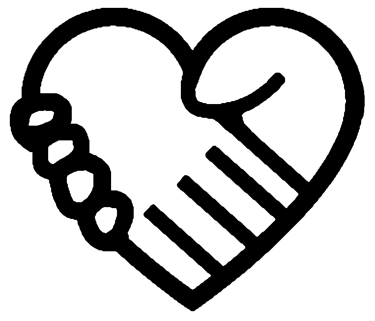

Objetivos Página: 

- [ ] Conceitos
	- [x] Nome Do Projeto:

		## "Organização Mangará"

	- [x] Paleta de Cores:

	

	- [x] Idéia do Projeto.
	
	- [X] Ícone do Projeto.
	
- [X] Header:
	- [x] Título que direciona a página principal. 
	- [X] Responsividade.
	- [X] Estilização.
	- [X] Outros elementos futuros.
- [X] Navbar:
    - [X] Links para as outras páginas.
    - [X] Responsividade.
    - [ ] Outros elementos futuros.
- [X] Marquee Bar
	- [ ] Conteúdo.
	- [X] Animação e estilização.
	- [X] Botão para ocultar.
