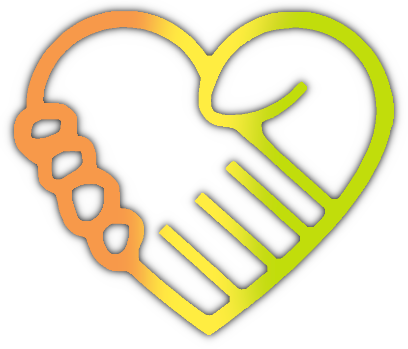

<!-- Informações do nosso Projeto -->
# TCC
*Projeto TCC* do curso de Programação WEB no período noturno, do primeiro semestre de 2023. O nosso grupo é constituído por:  
* [Gabriel Sousa.](https://github.com/Gabriel-Sousa-Amorim)
* [Carina Leandro Da Silva.](https://github.com/caleandro)
* [Patrick Santos Caño.](https://github.com/patricks10)

<!-- Conteúdo do Projeto -->

# Organização Mangará
### [Website Organização Mangará](https://gabriel-sousa-amorim.github.io/TCC/)
## Sobre o Projeto 

Com o nome de 'Organização Mangará', nosso projeto trata-se de um Website de uma <strong title="Organização não governamental">ONG</strong> com função social de direcionar doações de cestas básicas, alimentos não perecíveis, roupas, cobertores, brinquedos e entre outros. Funcionando com unidades de doação em diversas áreas da cidade São Paulo, e inclusive haver dias de coleta em bairros que não possuem as nossas unidades. A organização direcionará as doações para pessoas em situações em vulnerabilidade social, pessoas em situação de rua, comunidades carentes e outros.

 Ícone da Organização Mangaŕa

"Mangará" significa coração em Tupi-Guarani, tem sentido de que seja algo dado "de coração" e estamos direcionando as suas doações para pessoas passando por situações difíceis
<!--Sensibilidade a pessoas dislexicas-->

<!-- História -->
## Nossa História
A Organização Mangará teve seu início em 3 março de 2018 na cidade de São Paulo - SP, surgindo a partir de uma idealização de Pablo Sousa de ajudar a população em situação de vulnerabilidade social com doações, posteriormente as pessoas preocupadas com as desigualdades sociais e a falta de suporte com a população carente, decidiram se unir para por prática esses ideais. Movidos por compaixão, solidariedade e pelo desejo de fazer a diferença, fundamos a nossa organização visando fornecer assistência e apoio para aqueles que mais precisam, atuando na cidade de São Paulo. No começo, as operações da ONG eram modestas, com apenas uma pequena equipe de voluntários que trabalhava incansavelmente para arrecadar doações de alimentos, roupas, cobertores e outros itens essenciais, ao passar do tempo expandimos nossas ações sociais auxiliando comunidades carentes e comunidades vítimas de desastres naturais. Entre 2019 e 2020 ganhamos mais reconhecimento na área e algumas instituições e empresas começaram a nos apoiar, entretanto, ainda não tínhamos uma grande popularidade. A primeira unidade de doação e direcionamento foi estabelecida no Bom Retiro na Zona Central da cidade, próxima ao Conjunto Parque do Gato, onde a demanda por auxílio era significativa, além de fácil acesso a outras regiões do centro. Conforme a notícia sobre o trabalho da nossa organização se espalhava, mais pessoas se interessaram em se envolver e apoiar a causa. Gradualmente, novos voluntários se juntaram à equipe, permitindo a expansão das operações para outras áreas da cidade e novas unidades foi inaugurada na Zona Norte, a segunda unidade, mais precisamente no bairro do Parque Edu Chaves, com localização estratégica de fácil acesso a Guarulhos e outros bairros da zona norte.
<!-- Imagens do projeto -->

<!-- Referências -->
## [Referênciais de Fotos e outros assets do Projeto ](https://github.com/Gabriel-Sousa-Amorim/TCC/blob/main/Anotações/Referências.md)

<!-- QR CODE -->

---
